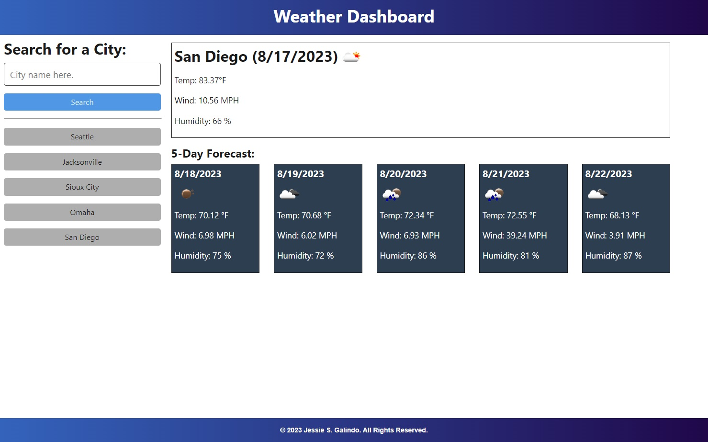

# Weather Dashboard

## Description

I was tasked with creating a working weather dashboard app that can show you the five day forecast on any given day to any city searched for. I used a combination of jQuery functions, ajax, for loops, Bootstrap components and an API function using a key from [OpenWeatherMap](https://openweathermap.org/).

## Installation

No installation necessary but you can clone the [repository](https://github.com/MrMessyFace/weather-dashboard) from GitHub to edit it and make your own version.

## Usage

When a user loads the page, a search bar appears and you can select the name of a city. When a city a selected, it shows the name of the city, the current date, an icon image describing the current weather, the current temperature, the current wind speed, and the current humidity near the top of the screen and a Five-Day forecast of the next 5 days near the bottom of the screen. Each time you search a new city, the previous searches appear in a list that you can use to revisit the data from that weather search.

## Credits

Code was originally taken from [Goldie369](https://github.com/Goldie369/Weather-Dashboard) and modified to show more weather information and color changes, but it was upgraded with code provided by the Northwestern University Full Stack Coding Bootcamp teaching staff.

## Helpful Links

- [Repository](https://github.com/MrMessyFace/weather-dashboard)
- [Live App](https://mrmessyface.github.io/weather-dashboard/)

&copy; 2023 Jessie S. Galindo. All Rights Reserved.
