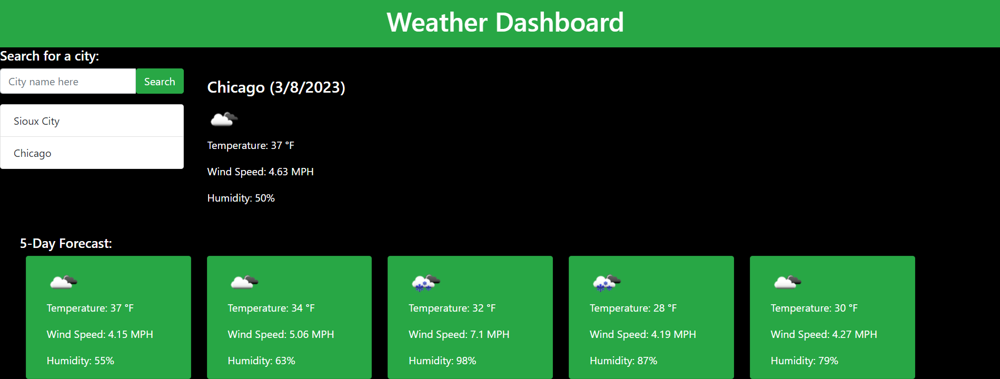

# Weather Dashboard

## Description

I was tasked with creating a working weather dashboard app that can show you the five day forecast on any given day to any city searched for.

## Installation

I used a combination of jQuery functions, ajax, for loops, Bootstrap components and an API function using a key from [OpenWeatherMap](https://openweathermap.org/).

## Usage

When a user loads the page, a search bar appears and you can select the name of a city. When a city a selected, it shows the name of the city, the current date, an icon image describing the current weather, the current temperature, the current wind speed, and the current humidity near the top of the screen and a Five-Day forecast of the next 5 days near the bottom of the screen.

## Credits

https://mrmessyface.github.io/weather-dashboard/